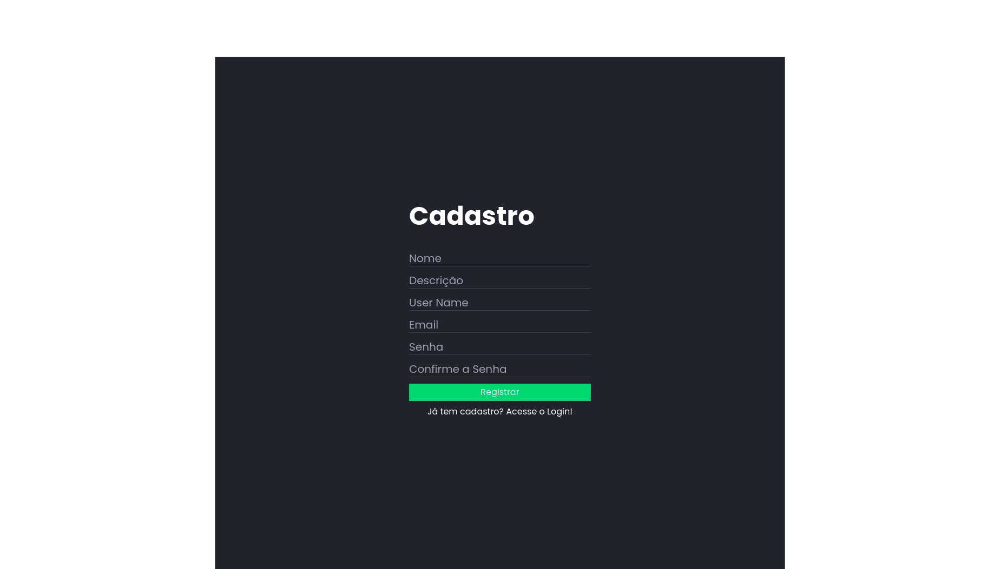
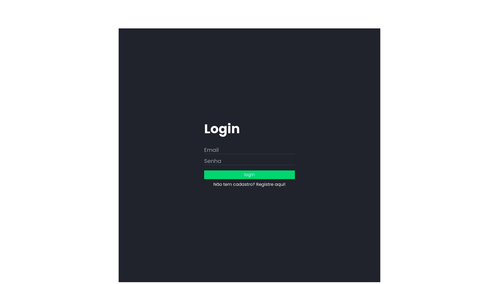
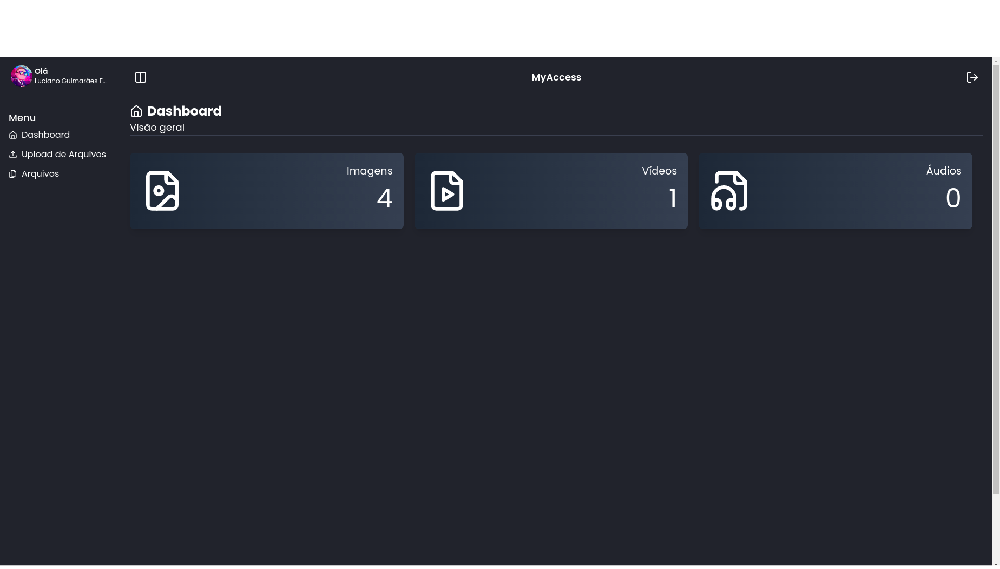
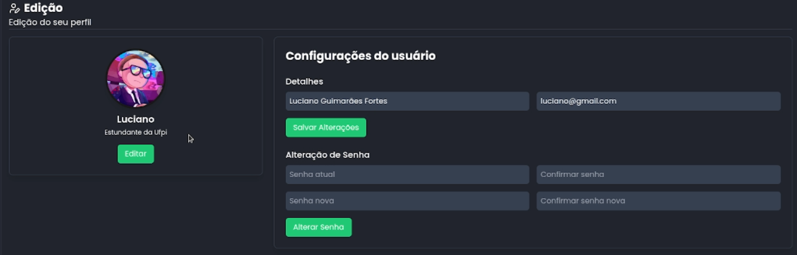
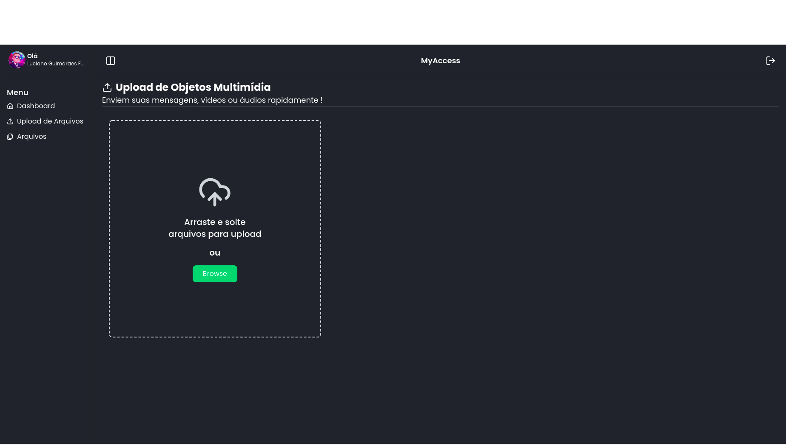
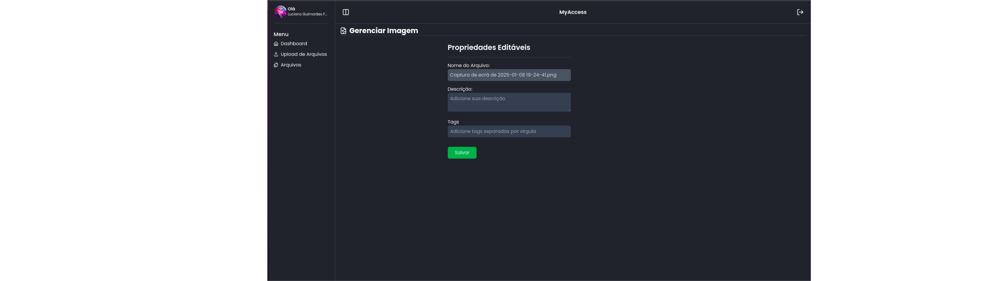
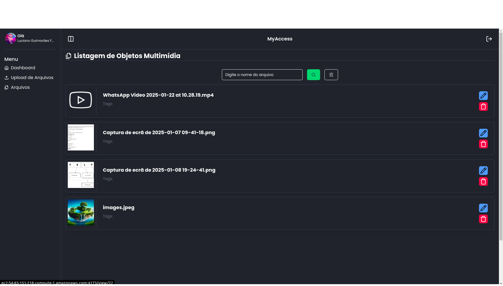

# Myaccess
Aplicação de gerenciamento de multimídia.

Projeto da disciplina de Tópicos de Engenharia de Software


## Tecnologias Utilizadas

Este projeto utiliza as seguintes tecnologias:

- **React**: Biblioteca para construção de interfaces dinâmicas e performáticas.
- **Tailwind CSS**: Framework de utilitários CSS para criação de designs responsivos.
- **Shadcn/UI**: Conjunto de componentes de interface de usuário baseadas no Tailwind CSS.
- **Lucide React**: Biblioteca de ícones otimizados e personalizáveis.
- **Axios**: Biblioteca usada para realizar requisições HTTP.


# Execução da aplicação

## Pré-requisitos
Precisa ter os seguintes itens instalados
- **Node.js**
- **NPM** ou **Yarn**

## Configuração do Ambiente
Clone o Repositório:
   ```
   git clone https://github.com/LUCIANOGFORTES02/Frontend-Engenharia-de-Sotware.git
```

## Instalação
Instale as dependências do projeto executando:

```
npm install
```

 ou

```
yarn install
```

## Execução da aplicação
1. Após instalar as dependências, execute o servidor de desenvolvimento:
   
    ```
   npm run dev
    ```
   
   ou

   ```
   yarn dev
   ```
3. Abra o navegador e acesse o endereço:
   ```
   http://localhost:5173
   ```

## Estrutura do Projeto
Estrutura basica do projeto:
```
├── src/
├── 📂 api # Integração com os serviços de API
│   |   ├── authService.ts # Gerencia chamadas de API relacionadas à autenticação
│   |   ├── userService.ts # Gerencia chamadas de API relacionadas ao usuário
│   |   └── axiosInstance.ts # Configuração do Axios com interceptadores
│   📂 auth/               # Gerenciamento de autenticação
│   |   ├── AuthContext.ts # Fornece o estado global e ações de autenticação
│   |   ├── AuthProvider.ts # Provedor de contexto para autenticação
│   |   ├── RequireAuth.ts # Componente de proteção de rotas
│   📂 components/         # Componentes reutilizáveis
│   📂 hooks/              # Hooks 
│   📂 pages/              # Páginas da aplicação
├── 📂 types # Tipos e interfaces do TypeScript
│   ├── App.tsx             # Componente raiz
│   ├── main.tsx            # Ponto de entrada da aplicação
├── public/                 # Arquivos estáticos
├── tailwind.config.js      # Configuração do Tailwind CSS
├── postcss.config.js       # Configuração do PostCSS
├── global.js               # Configurações globais (ex.: URL base da API)
├── package.json            # Dependências e scripts do projeto
└── README.md               # Documentação

```

## Imagens da Aplicação

> **Página de Cadastro**

> **Página de Login**

> **Dashboard**

> **Página de Edição de Perfil**


> **Página de Upload**


> **Página de Edição de mídia**



> **Página de Listagem**

